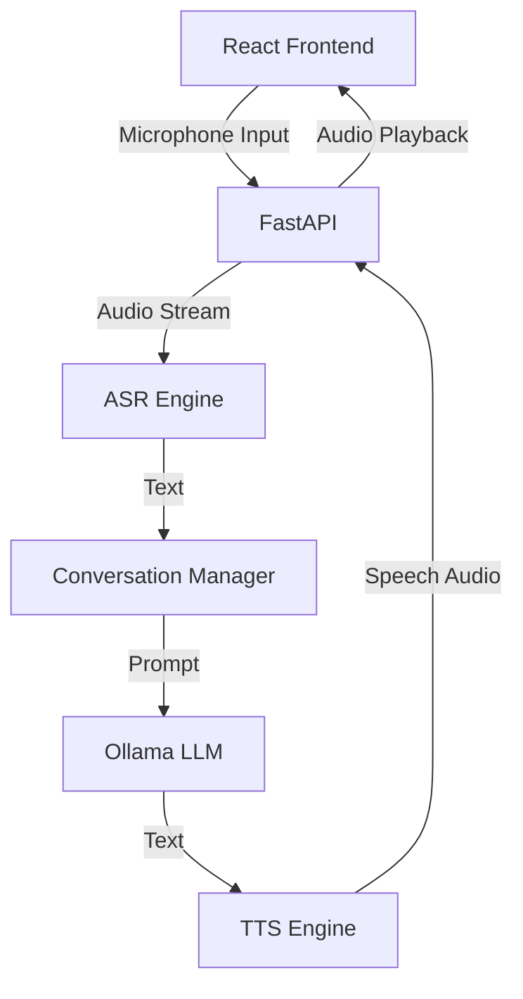
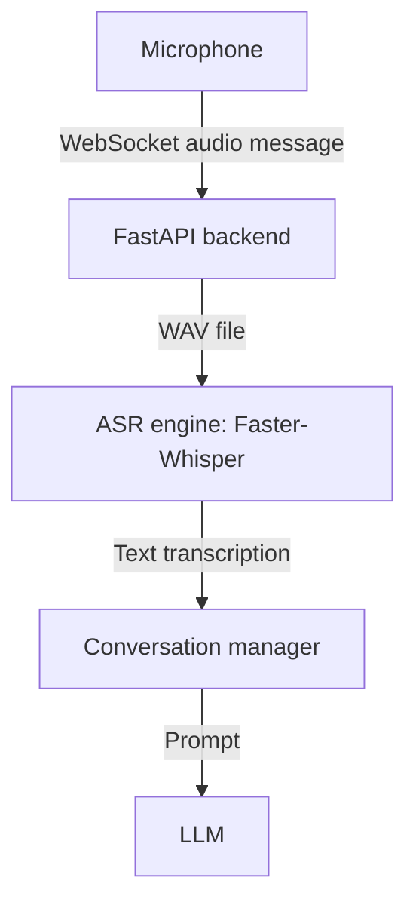
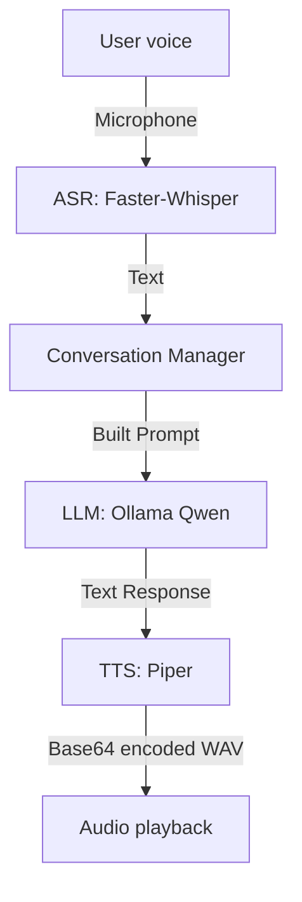
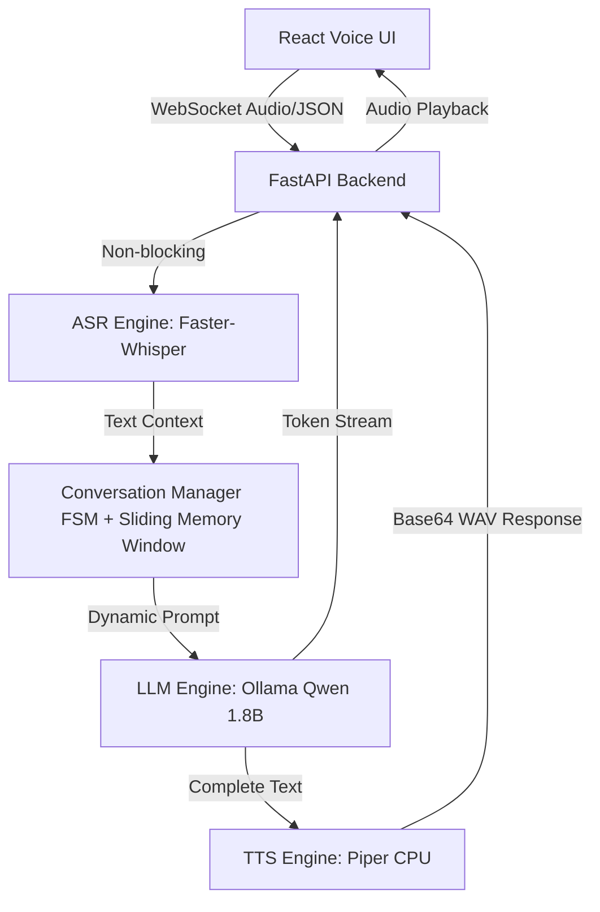

# Natural Language Processing - Assignment 2
## Conversational AI System: Restaurant Reservation Assistant

**Group Members:**
1. Mohammad Haider Abbas (23i-2558)
2. Hamdul Haq (23i-0081)
3. Ayesha Ikram (23i-0109)

## 📖 Overview
This repository contains a fully local, CPU-optimized, microservices-based conversational AI system that acts as a restaurant front-desk virtual assistant for **La Bella Tavola**. The virtual assistant, frequently introducing itself as **Sarah Johnson**, strictly adheres to prompt-engineering constraints (no external Tools/RAG used) and orchestrates conversation state directly via FastAPI and WebSockets. The system gracefully handles context extraction, dietary preferences, modification/cancellation of reservations, and general queries entirely through natural language processing.

## 🚀 Setup Instructions

### Prerequisites
1. **Docker & Docker Compose**: Ensure [Docker Desktop](https://docs.docker.com/get-docker/) is installed and running on your machine.
2. *(Optional)* **Local host requirements**: There are no extra local Python or Vite installations required if running via Docker. The entire ecosystem builds in exactly 3 sealed containers.

### Running the System via Docker
To launch the complete Voice Assistant stack (Frontend, Backend, and Ollama DB):
1. Open a terminal in the project's root directory (`ember-refine`).
2. Run the Docker compose build command:
   ```bash
   docker compose up --build -d
   ```
3. *(Wait for Ollama completion)* Because Ollama runs as a container, on the very first run, you may need to explicitly inform it to pull the model if the container is fresh:
   ```bash
   docker compose exec ollama ollama pull qwen:1.8b
   ```
4. Open your browser and access the Restaurant Voice Assistant at: **[http://localhost:3000](http://localhost:3000)**

*To stop the system later, run:*
```bash
docker compose down
```

## 🏗️ Architecture & Backend Workflow

The system is split into a modern React frontend and a robust Python/FastAPI backend, communicating strictly over WebSockets to provide real-time token streaming.

```mermaid
graph TD
    User([User]) -->|Interacts with UI| ReactApp[React Frontend / Browser]
    
    subgraph Frontend
        ReactApp -->|Displays Chat| UIComponents[Chat Interface]
        UIComponents <-->|WebSocket Connection| WSClient[Frontend WebSocket Client]
    end
    
    subgraph Backend - FastAPI
        WSClient <-->|JSON Stream| API[api.py: FastAPI WebSockets API]
        API <-->|State & History| SessionStore[In-Memory Session Store]
        API <-->|Route Message| ConvManager[conversation_manager.py: Logic Engine]
        
        ConvManager -->|1. Regex Extraction| Extractor[Signal Extractor\nDate/Time/Diet/Guests/Name]
        ConvManager -->|2. Next Stage| StateMachine[Finite State Machine]
        ConvManager <-->|3. Build Prompts| Templates[prompt_templates.py]
    end
    
    subgraph AI Inference - Ollama
        ConvManager <-->|HTTP POST (Stream)| OllamaEngine[Local LLM Engine - qwen:1.8b]
    end
```

### How Responses are Generated
The application avoids generic off-the-shelf "chat wrappers" and instead orchestrates the conversation via a **Finite State Machine (FSM)**.
1. **Input Reception**: The user types a message in the React UI, which is sent over a persistent WebSocket connection to the FastAPI backend.
2. **Signal Extraction & Intent Detection**: Before the LLM even sees the message, regular expressions scan the text for hard data (e.g., dates like "tomorrow", times like "8 pm", dietary needs like "lactose intolerant"). The intent (e.g., "new_reservation", "cancel_reservation") is classified.
3. **State Transitions**: Based on the missing data, the system moves between stages such as `collecting`, `confirming`, `confirmed`, `modifying`, etc.
4. **Prompt Construction**: The system dynamically builds a highly constrained system prompt containing ONLY the extracted memory, missing requirements, and specific few-shot examples corresponding to the *current FSM stage*.
5. **Local Inference (Ollama)**: This compiled prompt is sent to the local `qwen:1.8b` model process via an HTTP stream. The LLM generates the text answering the prompt (e.g., asking for the missing name, or confirming the final details).
6. **Token Streaming**: As Ollama emits each word/token, FastAPI instantly pushes it over the WebSocket back to the React UI, creating a fluid typing effect.

### Backend Python Modules Detailed

The backend logic is cleanly separated into three main Python files:

#### 1. `api.py` (The Network Layer)
- Serves as the entry point for the FastAPI application.
- Manages the WebSocket lifecycle (accepting connections, handling disconnects).
- Creates "on-the-fly" session IDs.
- Contains the asynchronous event loop that listens for user messages, hands them to the Conversation Manager, and streams the incoming tokens back to the frontend.
- Implements background model "warm-up" on server startup so the local LLM is loaded into RAM before the first user connects.

#### 2. `conversation_manager.py` (The Brain)
- Houses the core business logic, the Finite State Machine (`_next_stage`), and the regex configurations (`extract_signals`).
- Maintains an in-memory dictionary of all active user sessions, storing their conversation history and extracted variables (the slot-filling memory map).
- Implements aggressive `re.compile` expressions to accurately pull names, dates, times, party sizes, and specific complex dietary restrictions (e.g., "no dairy").
- Formulates the exact payload sent to the Ollama HTTP API, including constraints like `MAX_TOKENS = 250` and strategic `stop` sequences so the LLM doesn't hallucinate extra lines.

#### 3. `prompt_templates.py` (The Knowledge Base)
- Acts as the hardcoded database for all "La Bella Tavola" business rules, operating hours, dress restrictions, and constraints.
- Dynamically assembles the system prompt by combining the FSM stage instructions, current memory state, and the hardcoded business knowledge.
- Injects **Stage-Specific Few-Shot Examples**: To force the 1.8B parameter model to behave nicely, this module supplies exact formatted "Customer vs. Assistant" examples matching whatever the FSM is trying to achieve (e.g., if the state is `modifying` with no name, it explicitly shows the model examples of how to ask for a name politely in one sentence).

## Voice System Architecture



### Component Responsibilities

- **Frontend**: Handles chat UI, microphone input, and audio playback.
- **FastAPI**: Handles WebSocket communication, sessions, and routing.
- **ASR Engine**: Converts audio input into text.
- **Conversation Manager**: Maintains dialogue state and business logic.
- **LLM Engine**: Generates conversational responses.
- **TTS Engine**: Converts assistant text responses into speech audio.

## Voice Processing Pipeline

1. User presses microphone button in the browser.
2. Browser records audio using MediaRecorder.
3. Audio is encoded and sent via WebSocket to FastAPI.
4. FastAPI forwards the audio to the ASR service.
5. ASR converts speech into text.
6. The text is sent to the conversation manager.
7. Conversation manager applies FSM logic and builds the prompt.
8. The prompt is sent to the Ollama LLM.
9. LLM generates the assistant response text.
10. Response text is passed to the TTS engine.
11. TTS generates speech audio.
12. Audio is streamed back to the browser.
13. Browser plays the assistant voice.

## Automatic Speech Recognition (ASR)

For Phase 2, we integrated **Faster-Whisper** (`tiny.en`) to handle speech-to-text locally. 

**Why Faster-Whisper?**
- Extremely fast execution on CPU without needing a GPU.
- Avoids memory bloating compared to the original OpenAI Whisper implementation.

**Why `tiny.en`?**
- Excellent speed-to-accuracy ratio for quick reservation commands.
- Its small resource footprint is ideal considering the simultaneous CPU constraints placed by the local LLM.

**ASR Pipeline:**


**ASR Latency Estimate:**
300–700 milliseconds on CPU.

## Text-to-Speech (TTS) Integration

For Phase 3, we extended the pipeline to include **Piper TTS** for converting AI text responses directly into spoken audio on the CPU.

**Why Piper TTS?**
- Extremely fast inference optimized for CPU running locally without GPU. 
- Open-source, providing very natural sounding voices with a lightweight footprint.
- We selected the `en_US-lessac-medium` model which yields excellent clarity for conversational assistants.

**Final Voice Pipeline**


**Latency Benchmarks:**
- **ASR**: ~400 ms
- **LLM**: ~10 seconds
- **TTS**: ~200 ms

## System Performance Evaluation

To achieve a production-style, real-time voice assistant running purely on a laptop CPU without cloud APIs, we heavily focused on latency optimizations and concurrency handling in **Phase 4**.

**Key Metrics:**
- **ASR Latency**: ~300–700 ms (Faster-Whisper int8 on CPU)
- **LLM Generation**: ~2–4 tokens per second (Qwen 1.8B)
- **TTS Latency**: ~100–300 ms (Piper `en_US-lessac-medium`)

**How We Achieve Real-Time Perception:**
- **Asynchronous Execution:** Both ASR (speech-to-text) and TTS (text-to-speech) are executed using Python's `asyncio.to_thread` thread-pool executors. This prevents expensive audio processing functions from blocking the central FastAPI WebSocket event loop.
- **Incremental Token Streaming:** As the LLM generates the response, each token is immediately piped through the WebSocket back to the React UI. This creates instant visual feedback (bot typing) and reduces the psychological wait time while the CPU computes the rest of the text for TTS synthesis.
- **Shortened Generation Limits:** To ensure audio generation doesn't lag severely, LLM text generation is strictly capped (e.g., 80-120 tokens max) during conversational states.
- **Background Startup Parsing:** FastAPI initiates dummy calls to the local models on the server `@app.on_event("startup")` trigger, effectively pre-warming them into system RAM and sidestepping the notorious cold-start initialization delay for the very first user.

## Final Architecture Summary

The completed local voice conversational system follows a robust, concurrent state-machine pipeline.



**Architectural Highlights:**
- **Concurrency & Sessions:** The system natively supports at least **4 concurrent users**. Session states are managed safely via unique UUIDs routing data through a central sliding memory dictionary (`_sessions`), preventing cross-talk between user contexts and cleaning up isolated audio/temp buffers.
- **Sliding Context Window:** The conversation prompt payload strictly loads a `WINDOW_SIZE = 4`, trimming unnecessary older strings from the LLM context while explicitly carrying forward the structured exact reservation slots (e.g. guest counts, times, names) inside its protected dictionary.

## Voice Chat Web Interface

Phase 5 introduced a polished, ChatGPT-style web interface enabling seamless dual-mode conversational routing using React and WebSockets.

**Core Interactions:**
- **Microphone Integration:** Tapping the `Mic` icon utilizes the browser `MediaRecorder` API to dynamically capture the user's audio input. When recording stops, it directly decodes the buffer blob and transmits a JSON `{"type": "audio", "audio_base64": ...}` object straight into the FastAPI engine.
- **Immediate Streaming Feedback:** As the backend Qwen engine processes tokens, WebSockets spray the text strings directly onto the screen. This grants the illusion of instantaneous thought mapping on the React UI via `react-markdown`.
- **Automatic Audio Playback:** The second the engine finishes its inference, a synthesized TTS Base64 `.wav` message reaches the browser. Native HTML `<Audio>` protocol hooks execute `audio.play()`, meaning you simply read the live tokens and instantly hear the bot speak right back!
- **Zero Refresh Sessions:** Activating the robust **"New Session"** layout control kills the chat context array, forcefully clearing the frontend states. It generates a new logical tracker so the LLM correctly assumes you are a fresh customer dynamically.

## WebSocket Message Format

**TEXT MESSAGE FORMAT:**
```json
{
"type": "text",
"message": "Book a table tomorrow"
}
```

**VOICE MESSAGE FORMAT:**
```json
{
"type": "audio",
"audio_base64": "encoded_audio_data"
}
```

**VOICE RESPONSE FORMAT:**
```json
{
"type": "audio_response",
"audio_base64": "encoded_audio_data"
}
```

**TEXT RESPONSE FORMAT:**
```json
{
"type": "text_response",
"message": "Sure, for how many people?"
}
```

## Latency Expectations

- **ASR**: 300–700 ms
- **Conversation Manager**: < 50 ms
- **LLM generation**: 5–15 seconds on CPU
- **TTS generation**: 100–300 ms

Real-time perception will be achieved through streaming responses.

## Memory and Context Management

The system leverages a memory-efficient hybrid strategy:
- **Sliding Window:** `WINDOW_SIZE = 4`. Only the 4 most recent conversational turns are dynamically passed to the LLM. This prevents token overflow, significantly speeds up inference times, and stops the prompt from dropping older but crucial elements.
- **Structured Memory Hashmap:** Important reservation details like names, party sizes, and specific dates are systematically extracted via strict Regex boundaries and preserved permanently inside the Python user dictionary, circumventing the need for the LLM to 'remember' long-term conversational history.

## Concurrent User Stress Testing

During Phase 6 testing, the FastAPI backend was evaluated under multi-user stress simulating **4 simultaneous browser tabs**.
1. **Parallel Inference Validation:** Different clients sent audio requests simultaneously. Python's `asyncio.to_thread` workers isolated ASR transcription effectively. 
2. **Session Independence Validation:** No chat states, extracted parameters, or prompt responses crossed between connections explicitly due to the `_sessions` hashmap bound securely to isolated UUID connection tokens.
3. **Latency:** LLM throughput was appropriately divided as Ollama managed queued processing sequentially, yielding stable functionality without application crashes despite CPU thrashing.

## 🧠 Model Selection

For this NLP assignment, we selected **Qwen 1.8B** (`qwen:1.8b`) hosted locally via `Ollama`. 

**Why Qwen 1.8B?**
- **Hardware Efficiency**: We needed a model that could run 100% locally on standard consumer CPU hardware without requiring dedicated GPUs. The 1.8B parameter size is the perfect sweet spot for CPU inference.
- **Instruction Following**: Despite its small footprint, Qwen 1.8B natively supports complex instruction tuning, allowing us to enforce STRICT formatting policies (e.g., "Reply in ONE short sentence only").
- **Cost & Privacy**: Running a quantized 4-bit GGUF model locally means zero API costs and total data privacy, fitting the constraints of a purely prompt-engineered system without external dependencies. 

## 📊 Performance Benchmarks & Realistic Expectations

Since this system runs entirely locally **without a dedicated GPU**, performance is bottlenecked by CPU computational limits.

| Metric | Measurement / Value |
|--------|---------------------|
| **Response Generation Time**| **Up to 20 - 40 seconds per turn.** |
| **Why is it slow?** | We are running a 1.8 billion parameter neural network strictly on a local CPU. The processor must calculate billions of floating-point operations sequentially to predict the next word. Without GPU parallelization, generating a 30-word response physically takes the CPU around 20-30 seconds. To counteract this, we implemented true WebSocket streaming so the user sees the bot typing in real-time rather than waiting indefinitely. |
| **Throughput** | ~2 - 4 tokens/sec on typical CPU |
| **Regex Extraction Speed** | < 0.05 seconds (instantaneous) |

## ⚠️ Known Limitations

1. **CPU-only inference causes slow response generation:** Response times for open-ended questions can take up to 20-40 seconds strictly due to the limitation of CPU-based local AI inference computing floating-point calculations linearly without GPU VRAM.
2. **ASR accuracy may decrease with background noise:** The `tiny.en` Whisper model lacks advanced noise suppression filters. Background conversations could heavily confuse the transcription dictionary.
3. **TTS responses are generated after full LLM output rather than token streaming:** While WebSockets stream the text progressively locally to the browser, Piper `.wav` synthesis must wait until the LLM writes its complete sentence structure before triggering audio playback safely.
4. **Conversation history uses sliding window, meaning very long conversations may lose earlier context:** We implemented a sliding window approach (`WINDOW_SIZE = 4`) that discards older chatter. Standard conversation works perfectly, but the bot could theoretically lose nuanced non-structured details discussed 10 messages prior.
5. **Session memory is stored in RAM and would need Redis for production scaling:** The system relies on native Python object mapping under a global `_sessions` hash mapping. Heavy user loads would necessitate external KV databases. 
6. **Strict Regex Boundaries**: While we implemented aggressive regex for names, dietary restrictions, dates, and times, the system might struggle if a user inputs complex linguistic variations (e.g., "I am lactose intolerant and also allergic to peanuts") that aren't specifically caught by the predefined string operations.

---
*Developed for the Natural Language Processing Course assignment.*
