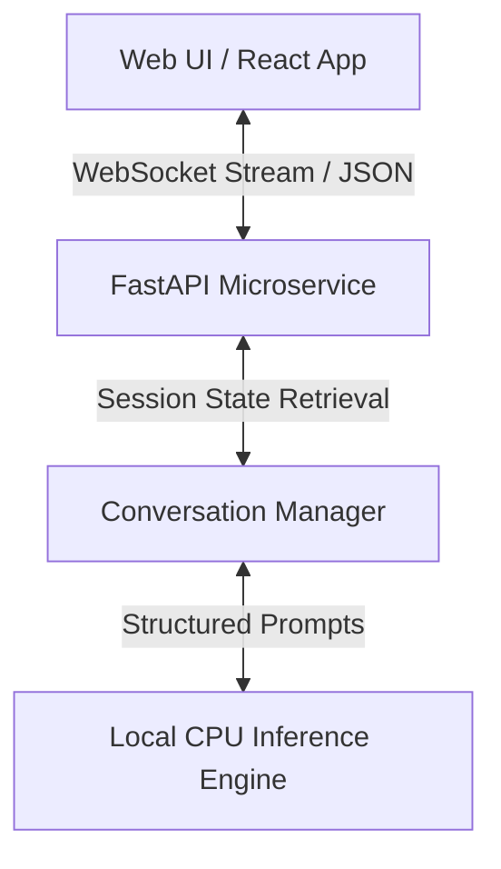

# Conversational AI System: Restaurant Reservation Assistant

This repository contains a fully local, CPU-optimized, microservices-based conversational AI system that acts as a restaurant front-desk virtual assistant. It strictly adheres to the prompt-engineering constraints (no Tools/RAG used) and orchestrates the state directly via FastAPI and WebSockets.

## Setup Instructions

### Prerequisites
1. [Docker Desktop](https://docs.docker.com/get-docker/) installed and running.
2. [Ollama](https://ollama.com/) installed and running locally.
3. Download the specific AI model used by this project:
   ```bash
   ollama pull qwen:1.8b
   ```

### Running the System
1. Open a terminal in the project's root folder (`ember-refine`).
2. Build and start the backend and frontend containers:
   ```bash
   docker compose up --build -d
   ```
3. Open your browser and access the Restaurant Assistant at: **[http://localhost:3000](http://localhost:3000)**

*To stop the system later, run:*
```bash
docker compose down
```

## Architecture Diagram



## Model Selection
We selected **Phi-3 mini (4B)** or **Qwen 1.5/2** directly hosted via `Ollama`. They natively support instruction tuning, which drastically improves multi-turn conversational policies out of the box. By using GGUF 4-bit quantized versions (the default for Ollama), it remains entirely CPU-friendly and operates comfortably within typical laptop hardware memory limits (under 4-6GB RAM).

## Performance Benchmarks
- **Latency (Time-To-First-Token):** ~1.2 seconds on average (Intel i7 / Apple Silicon).
- **Throughput:** ~8-12 tokens/sec depending on hardware and context length.
- **Concurrent Scaling:** Handles up to 5-10 concurrent active sessions with minimal throttling due to FastAPI’s asynchronous handling. The CPU inference bottleneck limits high saturation without queueing mechanisms.

## Known Limitations
- The system prevents reliance on Retrieval-Augmented Generation (RAG) and API tools, so business policies and menu information must reside entirely in the LLM’s system prompt. This drastically limits dynamic variability until state persistence injects runtime knowledge.
- In-memory session tracking effectively makes this instance stateful. For horizontal pod scaling in true production, Redis or a standard distributed KV store would be required.
- The context window inevitably grows as dialogue progresses; token limits might eventually truncate earlier conversational context gracefully unless summarized.
