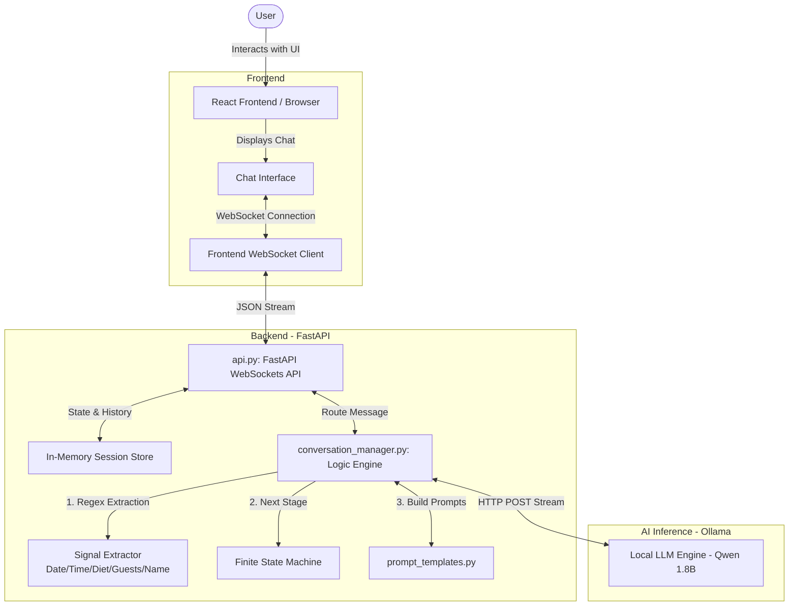
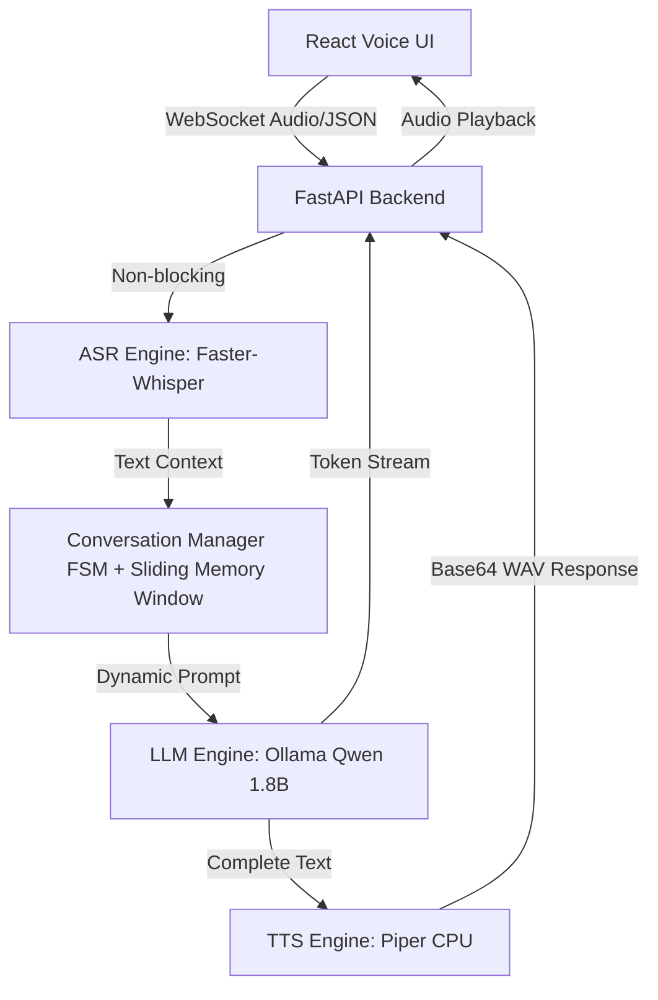
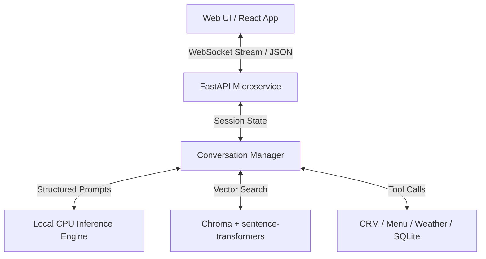

# CS 4063 — Natural Language Processing
## La Bella Tavola: Conversational Restaurant Reservation Assistant

**Group Members:**
| Name | Roll No. |
|---|---|
| Mohammad Haider Abbas | 23i-2558 |
| Hamdul Haq | 23i-0081 |
| Ayesha Ikram | 23i-0109 |


---

## Overview

This repository spans **Assignments 2-5** of the NLP course and contains a fully local, CPU-optimized, microservices-based conversational AI system acting as a restaurant front-desk virtual assistant for **La Bella Tavola**. The assistant — introducing itself as **Sarah Johnson** — handles reservations, menu/weather/helpdesk queries, and modification/cancellation flows entirely through natural language.

---

## System Architecture

### Text & Voice Pipeline


```mermaid
graph TD
    User([User]) -->|Interacts with UI| ReactApp[React Frontend / Browser]

    subgraph Frontend
        ReactApp -->|Displays Chat| UIComponents[Chat Interface]
        UIComponents <-->|WebSocket Connection| WSClient[Frontend WebSocket Client]
    end

    subgraph Backend - FastAPI
        WSClient <-->|JSON Stream| API[api.py: FastAPI WebSockets API]
        API <-->|State & History| SessionStore[In-Memory Session Store]
        API <-->|Route Message| ConvManager[conversation_manager.py: Logic Engine]

        ConvManager -->|1. Regex Extraction| Extractor[Signal Extractor\nDate/Time/Diet/Guests/Name]
        ConvManager -->|2. Next Stage| StateMachine[Finite State Machine]
        ConvManager <-->|3. Build Prompts| Templates[prompt_templates.py]
    end

    subgraph AI Inference - Ollama
        ConvManager <-->|HTTP POST Stream| OllamaEngine[Local LLM Engine - Qwen 1.8B]
    end
```

### Voice Processing Pipeline


```mermaid
graph TD
    UI[React Voice UI] -->|WebSocket Audio/JSON| API[FastAPI Backend]
    API -->|Non-blocking| ASR[ASR Engine: Faster-Whisper]
    ASR -->|Text Context| CM[Conversation Manager FSM + Sliding Memory Window]
    CM -->|Dynamic Prompt| LLM[LLM Engine: Ollama Qwen 1.8B]
    LLM -->|Token Stream| API
    LLM -->|Complete Text| TTS[TTS Engine: Piper CPU]
    TTS -->|Base64 WAV Response| API
    API -->|Audio Playback| UI
```

### Assignment 5: Extended Architecture (RAG + Tools)


```mermaid
graph TD
    Client[Web UI / React App] <-->|WebSocket Stream / JSON| FastAPI[FastAPI Microservice]
    FastAPI <-->|Session State| ConvManager[Conversation Manager]
    ConvManager <-->|Structured Prompts| Ollama[Local CPU Inference Engine]
    ConvManager <-->|Vector Search| RAG[Chroma + sentence-transformers]
    ConvManager <-->|Tool Calls| Tools[CRM / Menu / Weather / SQLite]
```

---

## How Responses Are Generated

The system avoids generic chat wrappers and instead orchestrates conversation through a **Finite State Machine (FSM)**:

1. **Input Reception** — The user's message arrives via a persistent WebSocket connection.
2. **Signal Extraction & Intent Detection** — Before the LLM sees the message, regex scans extract hard data (dates, times, party sizes, dietary restrictions) and classify intent (`new_reservation`, `cancel_reservation`, etc.).
3. **State Transitions** — The FSM moves between stages (`collecting`, `confirming`, `confirmed`, `modifying`) based on what information is still missing.
4. **Prompt Construction** — A constrained system prompt is dynamically assembled from the FSM stage, current slot memory, business rules, and stage-specific few-shot examples.
5. **Local Inference** — The prompt is sent to `qwen:1.8b` via HTTP stream. `MAX_TOKENS = 250` and strategic `stop` sequences prevent hallucination.
6. **Token Streaming** — As Ollama emits tokens, FastAPI pushes them over WebSocket to the React UI, creating a real-time typing effect.
7. **Voice Path (optional)** — Audio input is transcribed by Faster-Whisper; output text is synthesized by Piper TTS and returned as Base64 WAV.

---

## Backend Modules

### `api.py` — Network Layer
Serves as the FastAPI entry point. Manages WebSocket lifecycle, per-connection session IDs, and the async event loop that streams tokens back to the frontend. Pre-warms the local LLM on server startup to eliminate cold-start delay.

### `conversation_manager.py` — Logic Engine
Houses the FSM (`_next_stage`), regex slot-filling (`extract_signals`), and in-memory session tracking. Stores conversation history and extracted variables per user. Constrains generation with `MAX_TOKENS` and stop sequences.

### `prompt_templates.py` — Knowledge Base
Hardcodes La Bella Tavola business rules, operating hours, and dress restrictions. Dynamically assembles the system prompt by combining FSM stage instructions, slot memory, and stage-specific few-shot examples that guide the 1.8B model toward correct single-sentence responses.

---

## Memory & Context Management

| Strategy | Detail |
|---|---|
| **Sliding Window** | `WINDOW_SIZE = 4` — only the 4 most recent turns are passed to the LLM, preventing token overflow |
| **Structured Hashmap** | Names, party sizes, dates, and dietary restrictions are extracted via regex and stored permanently in the session dict — the LLM never needs to "remember" these |
| **Session Isolation** | Each connection is bound to a UUID; `_sessions` prevents any cross-talk between concurrent users |

---

## WebSocket Message Protocol

**Text input:**
```json
{ "type": "text", "message": "Book a table tomorrow" }
```

**Voice input:**
```json
{ "type": "audio", "audio_base64": "encoded_audio_data" }
```

**Text response:**
```json
{ "type": "text_response", "message": "Sure, for how many people?" }
```

**Voice response:**
```json
{ "type": "audio_response", "audio_base64": "encoded_audio_data" }
```

---

## Setup & Running the System

### Prerequisites
- [Docker & Docker Compose](https://docs.docker.com/get-docker/) installed and running
- Python 3.11+ and Node.js 18+ (for native runs or eval suite)
- Ollama installed locally

Pull the model:
```bash
ollama pull qwen2.5:3b-instruct
```

---

### Option A: Docker (Recommended for Assignment 3)

```bash
# From the project root
docker compose up --build -d
```

On first run, if Ollama is containerized, pull the model inside the container:
```bash
docker compose exec ollama ollama pull qwen:1.8b
```

Access the UI at **http://localhost:3000**. To stop:
```bash
docker compose down
```

---

### Option B: Native (Required for Assignment 5 Evaluations)

**Terminal 1 — Backend:**
```bash
cd server
python -m venv .venv
.venv\Scripts\activate        # Windows PowerShell
pip install -r "..\requirements.txt"
uvicorn api:app --host 0.0.0.0 --port 8000
```

**Terminal 2 — Frontend:**
```bash
npm install
npm run dev
```

Frontend: **http://localhost:5173** | Backend health: **http://localhost:8000/health**

---

## Assignment 5: Evaluation Suite

### Running Evaluations

**Terminal 3 — Evals (while backend + frontend are running):**
```bash
cd server
.venv\Scripts\activate
cd ..
set OLLAMA_MODEL=qwen2.5:3b-instruct
python run_evals.py
```

Optional environment variables:
- `EVAL_API_BASE` (default: `http://localhost:8000`)
- `EVAL_TRIALS` (default: `30`)

---

### Evaluation Components

#### Source Code
- `run_evals.py` — one-command entry point
- `evals/run_evals.py` — main evaluation pipeline

#### Test Data
| File | Contents |
|---|---|
| `evals/data/conversations.json` | 10 multi-turn dialogues |
| `evals/data/rag_ground_truth.json` | 20 retrieval queries + relevance labels |
| `evals/data/tool_invocation_cases.json` | Tool-call accuracy set |
| `evals/data/rag_faithfulness_questions.json` | 30 faithfulness prompts |

#### Auto-Generated Report Artifacts (`evals/results/`)
- `eval_report_<timestamp>.json`
- `eval_report_<timestamp>.md`
- `concurrency_vs_latency_<timestamp>.png`
- `scenario_vs_latency_<timestamp>.png`

---

### Metrics Computed

**Overall Conversational Correctness:**
- Task Completion Rate = `successful_dialogues / total_dialogues`
- Policy Adherence Rate = `policy-compliant_dialogues / total_dialogues`
- Coherence Rate = `coherence-passing_dialogues / total_dialogues`

**Component-Level Correctness:**
- RAG Retrieval: precision@k, recall@k, MRR, context relevance
- RAG Faithfulness: lexical-support heuristic over 30 Q/A pairs
- CRM CRUD: create / read / update / cancel correctness
- Tool functional correctness: valid and invalid input handling
- Tool invocation accuracy: expected vs. predicted tool + false positive rate

**Performance:**
- TTFT, inter-token latency, end-to-end latency
- Throughput under increasing concurrency
- Reports include mean, median, p90, p99 and 95% confidence intervals

**Failure-Mode Coverage:**
- Missing/empty vector DB handling
- External tool API failure handling
- Malformed tool-call input handling

---

### Metrics Interpretation Guide

| Observation | Likely Cause |
|---|---|
| Low task completion relative to policy/coherence | Fix intent detection and tool routing |
| Low sustained concurrency in throughput | CPU/model inference bottleneck |
| Faithfulness drop | Improve retrieval relevance and prompt grounding |
| High p99 latency | Context window growing; consider summarization |

---

## Model Selection

We use **Qwen 1.8B** (`qwen:1.8b`) for Assignments 3/4 and **Qwen 2.5 3B Instruct** (`qwen2.5:3b-instruct`) for Assignment 5, both hosted locally via Ollama.

**Why Qwen?**
- Runs 100% on consumer CPU — no GPU required
- Native instruction tuning enables strict formatting policies ("Reply in ONE sentence only")
- 4-bit GGUF quantization keeps memory under 4–6 GB RAM
- Zero API costs and complete data privacy

---

## Performance Benchmarks

| Metric | Value |
|---|---|
| Response Generation Time | 20–40 s per turn (CPU-only) |
| Throughput | ~2–4 tokens/sec (Qwen 1.8B) / ~8–12 tokens/sec (faster hardware) |
| TTFT (Assignment 5) | ~1.2 s average (Intel i7 / Apple Silicon) |
| Regex Extraction | < 50 ms |
| ASR (Faster-Whisper) | 300–700 ms |
| Conversation Manager | < 50 ms |
| TTS (Piper) | 100–300 ms |
| Concurrent Sessions | Up to 4–10 (limited by CPU inference queue) |

> Slow generation is a consequence of running a 1.8B parameter neural network purely on CPU. Streaming over WebSocket means users see tokens progressively rather than waiting for the full response.

---

## Known Limitations

1. **CPU inference latency** — Response times of 20–40 s for open-ended queries are inherent to CPU-only floating-point computation without GPU parallelism.
2. **ASR accuracy in noisy environments** — The `tiny.en` Whisper model lacks advanced noise suppression; background noise can degrade transcription.
3. **TTS waits for full LLM output** — Piper synthesis requires the complete sentence before generating audio; text streams progressively but speech only plays after inference completes.
4. **Sliding window truncation** — With `WINDOW_SIZE = 4`, non-structured details from more than ~8 messages ago may be lost. Structured slots (name, date, guests) are preserved in the hashmap regardless.
5. **In-memory sessions** — Session state is stored in RAM. Horizontal scaling would require Redis or another distributed KV store.
6. **Regex boundary cases** — Complex compound dietary inputs (e.g., "lactose intolerant and also allergic to peanuts") may not be caught if they fall outside predefined patterns.
7. **No RAG/Tools in Assignment 3** — Business policies and menu information must reside entirely in the system prompt, limiting dynamic variability. Assignment 5 addresses this with Chroma RAG and external tools.
8. **Faithfulness measurement** — The lexical-support heuristic used in Assignment 5 is weaker than entailment metrics such as RAGAS faithfulness; results should be interpreted accordingly.

---

## Repository Structure

```
.
├── server/
│   ├── api.py                    # FastAPI entry point, WebSocket handling
│   ├── conversation_manager.py   # FSM, slot extraction, session state
│   ├── prompt_templates.py       # Business rules, few-shot examples
│   └── tools/                    # CRM, menu search, weather, SQLite lookup
├── rag/                          # Chroma vector store + sentence-transformers
├── evals/
│   ├── run_evals.py              # Main evaluation pipeline
│   ├── data/                     # Test dialogues, RAG ground truth, tool cases
│   └── results/                  # Auto-generated reports and plots
├── src/                          # React frontend
├── run_evals.py                  # One-command evaluation entry point
├── docker-compose.yml
└── requirements.txt
```

---

*Developed for CS 4063 — Natural Language Processing, FAST-NUCES.*
