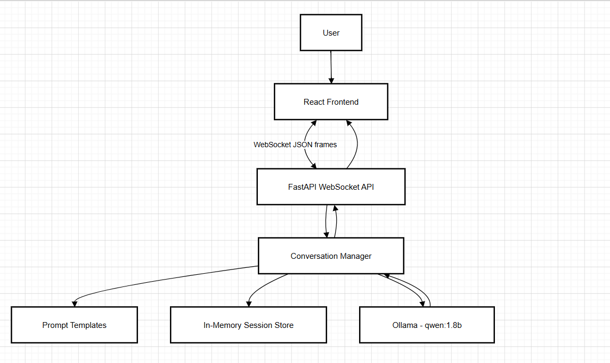

# CS 4063 - Natural Language Processing
## Assignment 4: Conversational AI (RAG + Tools Extension)

### Project
**La Bella Tavola Conversational Reservation Assistant**

### Group Members
1. Mohammad Haider Abbas (23i-2558)  
2. Hamdul Haq (23i-0081)  
3. Ayesha Ikram (23i-0109)

## Business Use Case
This system is a restaurant-domain conversational AI assistant for **La Bella Tavola**. It provides real-time chat for reservation workflows: creating bookings, modifying existing reservations, canceling reservations, and answering restaurant policy questions.

The assistant is designed to simulate a practical front-desk workflow with:
- guided information collection (`name`, `date`, `time`, `guests`),
- dialogue-state tracking across turns,
- and low-latency token streaming for better user experience.

## Architecture Diagram


## Architecture Explanation
- **React Frontend (`src/`)**: renders chat UI and sends/receives WebSocket events.
- **FastAPI + WebSocket (`server/api.py`)**: accepts chat requests, manages sessions, and streams generated tokens back to UI.
- **Conversation Manager (`server/conversation_manager.py`)**: handles state machine transitions, intent detection, slot extraction, prompt assembly, and Ollama streaming calls.
- **Prompt Templates (`server/prompt_templates.py`)**: contains stage-specific prompt logic and few-shot behavior constraints.
- **LLM Engine (Ollama: `qwen2.5:3b-instruct`)**: local CPU inference backend for response generation.

## Model Selection
- **Model**: `qwen2.5:3b-instruct`
- **Runtime**: Ollama local inference
- **Why this choice**:
  - lightweight enough for CPU-only environments,
  - strong instruction following for structured response style

### Performance Characteristics (Observed)
- Approximate generation rate: **2-4 tokens/sec** on CPU.
- Typical long response time: **20-40 seconds** (hardware dependent).
- First-response latency improved through startup warmup.

## Document Collection (RAG Requirement)
50 documents related to restaurant collected and stored in vector DB(Chroma)
Indexer script for Restaurant Documents:
    - Loads all .txt files from a specified folder with error handling.
    - Splits documents into chunks with overlap and logs chunk statistics.
    - Initializes a HuggingFace embedding model with error handling.
    - Creates and persists a Chroma vector database, cleaning old data if exists.
    - Logs detailed information at each step for monitoring and debugging.
Retriever script for the Restaurant RAG system. Handles:
    - Loading the Chroma vector database
    - Initializing the Ollama LLM client
    - Providing a method to retrieve relevant documents for a query
    
## Tools Description (CRM + 3 Tools)
Assignment 4 requires one CRM tool plus three additional tools callable during conversation.

Current working path in this snapshot focuses on conversational FSM + streaming. For final grading, this section should include:
1. **CRM Tool**  
   - Purpose: store/retrieve/update user profile and history by session/user ID  
   - Input schema and sample call  
2. **Menu** - Lists all items on the menu  
3. **Weather** - Uses api to lookup weather in the restaurant's location (Italy), this helps in determining if outdoor sitting is suitable.  
4. **Reservation_Lookup** - Retrieves reservation details using sqlite.  

Also include:
- async execution model,
- timeout strategy,
- error handling fallback.

## Real-Time Optimization
The backend includes several practical latency optimizations:
- token-level streaming over WebSocket (`token` event frames),
- asynchronous request pipeline,
- persistent `httpx.AsyncClient` for reduced connection overhead,
- model pre-warm task at startup,
- sliding context window (`WINDOW_SIZE`) to keep prompts compact,
- deterministic bypass responses for simple greeting/off-topic messages.

### Benchmark Summary
- **Retrieval time**: N/A in current live snapshot.
- **Tool latency**: N/A in current live snapshot.
- **End-to-end latency (LLM replies)**: typically CPU-bound and hardware dependent.

## Setup Instructions
### Prerequisites
1. Docker Desktop + Docker Compose
2. Ollama installed and running locally
3. Pull model once:

```bash
ollama pull qwen2.5:3b-instruct
```

### Run the System
From project root:

```bash
docker compose up --build -d
```

### Access URLs
- Frontend: `http://localhost:3000`
- Backend API: `http://localhost:8000`

### Stop

```bash
docker compose down
```

## API and Testing
### REST Endpoints
- `GET /health`
- `POST /session`
- `GET /session/{session_id}`
- `POST /session/{session_id}/reset`

### WebSocket Endpoint
- `/ws/chat`
- Stream events: `session`, `token`, `end`, `error`

### Postman Collection
- `server/Postman_Collection.json`

## Docker and Dependencies
- Backend container: `server/Dockerfile`
- Frontend container: `Dockerfile.frontend`
- Multi-service orchestration: `docker-compose.yml`
- Backend Python deps: `server/requirements.txt`
- Frontend deps: `package.json`

## Known Limitations
- RAG modules and tool orchestration slow down response time although optimization techniques applied.
- Session memory is in-memory only (resets on server restart).
- CPU inference latency increases for longer responses.
- Regex extraction may miss highly unusual phrasing patterns.

## Assignment 5 Evaluation Suite
An automated evaluation pipeline is included under `evals/` and can be executed with one command.

### Run Evaluations
1. Start the backend API first (`uvicorn api:app --host 0.0.0.0 --port 8000`).
2. From repository root run:

```bash
python run_evals.py
```

Optional environment variables:
- `EVAL_API_BASE` (default: `http://localhost:8000`)
- `EVAL_TRIALS` (default: `30`, used for latency trials)

### Output Artifacts
- JSON report: `evals/results/eval_report_<timestamp>.json`
- Markdown report: `evals/results/eval_report_<timestamp>.md`
- Plot files:
  - `evals/results/concurrency_vs_latency_<timestamp>.png`
  - `evals/results/scenario_vs_latency_<timestamp>.png`

### Evaluation Data Included
- Test conversations (10 dialogues): `evals/data/conversations.json`
- RAG retrieval ground-truth queries (20): `evals/data/rag_ground_truth.json`
- Tool invocation test set: `evals/data/tool_invocation_cases.json`
- Faithfulness question set (30): `evals/data/rag_faithfulness_questions.json`

### Metrics and Formulas
- **Task completion rate** = completed_dialogues / total_dialogues
- **Policy adherence rate** = policy-compliant_dialogues / total_dialogues
- **Coherence rate** = coherent_dialogues / total_dialogues
- **Precision@k** = relevant_retrieved / k
- **Recall@k** = relevant_retrieved / relevant_total
- **MRR** = mean(1 / rank_of_first_relevant)
- **TTFT** = time(first token) - time(request sent)
- **Inter-token latency** = mean(delta between consecutive token timestamps)
- **End-to-end latency** = time(last token/end event) - time(request sent)
- **Throughput** = total_turns / elapsed_seconds

95% confidence intervals are reported for means using a normal approximation.

### Assumptions and Limitations
- Faithfulness is computed via a deterministic lexical-support heuristic unless replaced with an external framework (e.g., RAGAS).
- Mixed RAG+tool scenario is approximated as a compound request because tool routing is deterministic in this architecture.
- Performance metrics are hardware-dependent; run on a quiet machine for reproducible numbers.
- Failure modes included in the suite:
  - missing/empty vector database handling,
  - external tool API failure handling,
  - malformed tool-call input handling.


