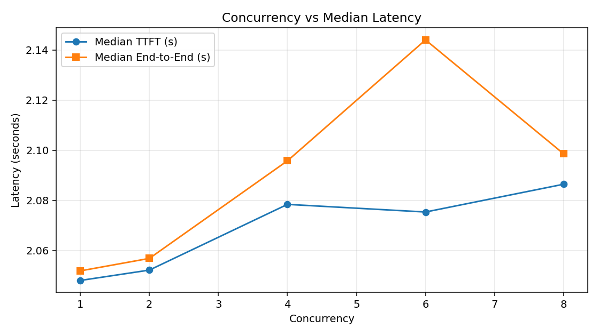
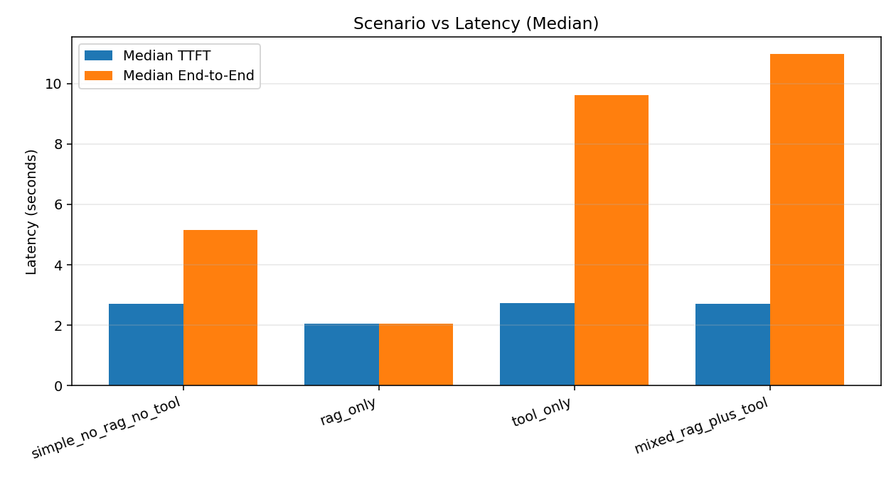

# Assignment 5 Evaluation Report

- Generated: 2026-05-04T15:03:29+00:00
- API Base: `http://localhost:8000`
- Model: `qwen2.5:3b-instruct`

## Overall Conversational Correctness
- Dialogues evaluated: **10**
- Task completion rate: **70.00%**
- Policy adherence rate: **100.00%**
- Coherence rate: **100.00%**

## Component-Level Correctness
- CRM CRUD score: **100.00%**
- Tool functional score: **100.00%**
- Tool invocation accuracy: **83.33%**
- Tool false-positive rate: **0.00%**
- RAG precision@k: **0.417**
- RAG recall@k: **0.675**
- RAG MRR: **0.458**
- RAG faithfulness (heuristic): **0.690**

## Latency
### simple_no_rag_no_tool
- Trials: 30 (success 30, fail 0)
- TTFT mean/median/p90/p99: 4.300s / 2.714s / 2.774s / 36.421s
- End-to-end mean/median/p90/p99: 6.639s / 5.156s / 5.313s / 39.443s

### rag_only
- Trials: 30 (success 30, fail 0)
- TTFT mean/median/p90/p99: 2.051s / 2.049s / 2.066s / 2.077s
- End-to-end mean/median/p90/p99: 2.054s / 2.051s / 2.070s / 2.082s

### tool_only
- Trials: 30 (success 30, fail 0)
- TTFT mean/median/p90/p99: 3.446s / 2.735s / 2.786s / 17.915s
- End-to-end mean/median/p90/p99: 10.248s / 9.630s / 10.045s / 25.293s

### mixed_rag_plus_tool
- Trials: 30 (success 30, fail 0)
- TTFT mean/median/p90/p99: 2.744s / 2.716s / 2.803s / 3.167s
- End-to-end mean/median/p90/p99: 11.374s / 10.992s / 13.080s / 14.981s

## Throughput
- Max sustainable concurrency: **0**
- Breakpoint concurrency: **1**
- Throughput at sustainable level: **0.000 turns/sec**

## Plots

## Analysis
- Task completion is **70.00%** primarily because dialogues ['conv_02_policy_refusal', 'conv_09_lookup', 'conv_10_out_of_scope_code'] did not satisfy their final-task rubric; the most visible gap is reservation lookup phrasing.
- Throughput threshold failed because median TTFT stayed above the configured 2.0s target (lowest observed around 2.048s at concurrency 1), so no concurrency level met all constraints.

## Failure-Mode Checks
- Failure-mode score: **100.00%**
- `empty_vector_db_handled`: PASS
- `tool_api_failure_handled`: PASS
- `malformed_tool_call_handled`: PASS

## Environment
- Hardware: `{"platform": "Windows-11-10.0.26200-SP0", "python": "3.12.3", "cpu": "Intel64 Family 6 Model 154 Stepping 4, GenuineIntel", "cpu_count_logical": 12, "machine": "AMD64", "disk_free_gb_estimate": null}`
- Dependencies: `{"fastapi": "0.136.1", "uvicorn": "0.46.0", "websockets": "16.0", "httpx": "0.28.1", "langchain": "1.2.17", "chromadb": "1.5.8", "sentence-transformers": "5.4.1", "ollama": "unknown"}`

## Notes
- Faithfulness is computed with a reproducible lexical-support heuristic (chosen for fully offline reproducibility).
- Limitation: lexical support is weaker than entailment-based metrics (e.g., RAGAS faithfulness) and can over/under-estimate factual grounding.
- Mixed scenario is approximated as a compound user request because this chatbot routes tools deterministically.
